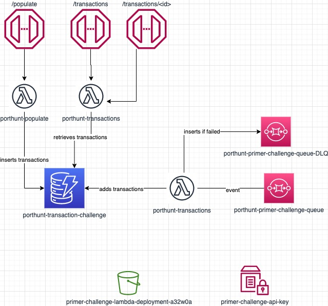

# primer-challenge
The objective of this assessment was to deploy a REST API that could retrieve transactions from a DynamoDB table.

## Architecture
The `terraform/` directory hosts all the resources that are used. I decided to keep the `playground` directory, since I didn't think it would be useful to create three AWS accounts for each environment (dev/qa/prod).

The lambda functions are zipped and deployed to S3. All of them share the same zip file (more on this later).

It was a requirement to use terraform to deploy the API Gateway + Lambda functions, but in my opinion a better approach for this would be using [serverless framework](https://www.serverless.com). This would offset the hassle of creating the terraform resources and would allow developers to work on the code itself, just with some minor configuration on `serverless.yml`.

To show how this could be done, I decided to have a second API deployed using serverless framework. The lambda functions are all zipped and deployed to S3 on the same file, because I just reuse the code used on this second API.

Please refer to `primer-api/` for more API information or `terraform/` for more infrastructure-related information.

## Pipelines

There are two workflows:

### Infrastructure Destroy
This is a manually triggered workflow to destroy the entire infrastructure. First it deletes the API created using serverless framework and later it deletes all the terraform resources.

### API Deploy
This workflow consists of four steps:

#### validate/tests
* validate: Executes linting on the API code, checks bandit for security issues and executes a check for terraform format.
* tests: Executes the unit tests.

#### tf-deploy
The objective of this job is to deploy the entire terraform infrastructure. It zips the content of `primer-api/` and executes terraform plan/apply.

#### deploy-serverless-framework-api
This needs to run after `tf-deploy` since it depends on some resources created by terraform (e.g. S3 bucket, API key on parameter store, etc). The point of this job is to deploy the API created using serverless framework.

#### verify
The point of this job is to execute the functional tests. These tests were created just to validate that the endpoints are deployed, the api key works as expected and the responses are correct. It was only created to show that everything is working correctly. In a real-world scenario, this would run with `validate/tests` using a locally deployed API (using serverless-offline, for example). The Invoke URL is printed before the tests results, so requests can be done locally.

> Note: Verify doesn't add a limit, therefore the default is 100. If this job is ran multiple times, it will start failing, since there will be more than 100 transactions on the table and we don't specify a limit on the test. This is not supposed to be ran multiple times. If needed, for some unknown reason, the table must be emptied first.

## Known issues
* The pipelines have a plan/apply, but it would be better to have a manual confirmation before applying. I would solve this using 'Environments' on the repository settings and adding people as reviewers, but that feature is not available (only available on GitHub Pro).
* Current API keys are set for the terraform deployed API and the serverless API. Two different ones must be created, if not, serverless framework complains that it exists already. Therefore, the only difference between them is a "2" at the end of the second one. This was just a workaround to generate a different API Key for the serverless framework API and can (of course) be removed from a final version. It was only for a demostration of a second API that makes developers life easier. **Both APIs have the same configuration.**
* Invoke URL is printed during the tests on the `verify` job. Not the best way of doing it, but it was the easiest way to provide a URL for a test during a review.
